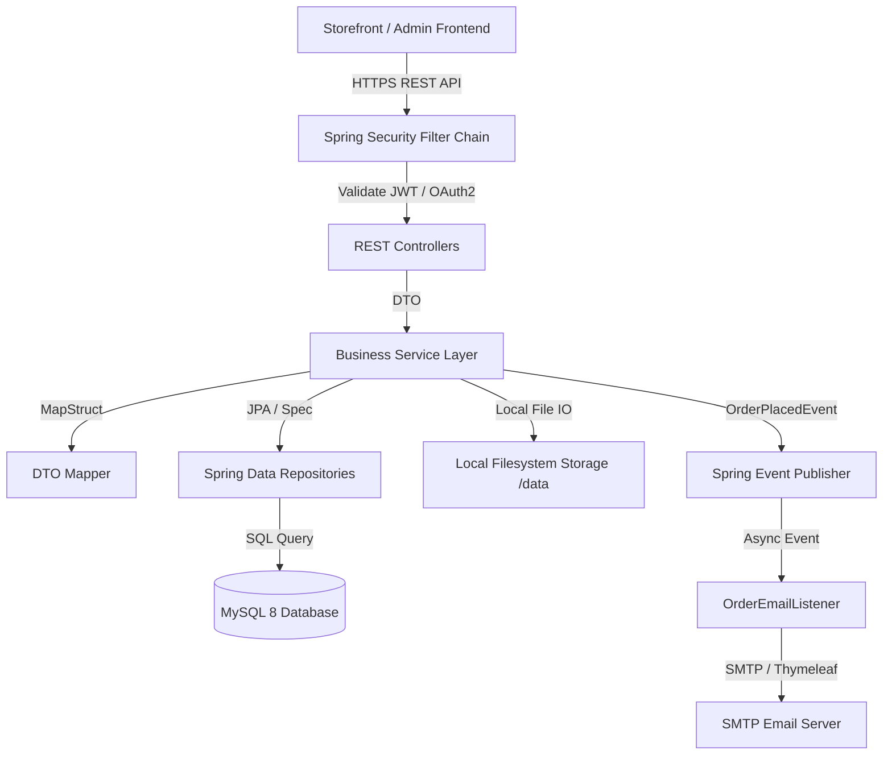
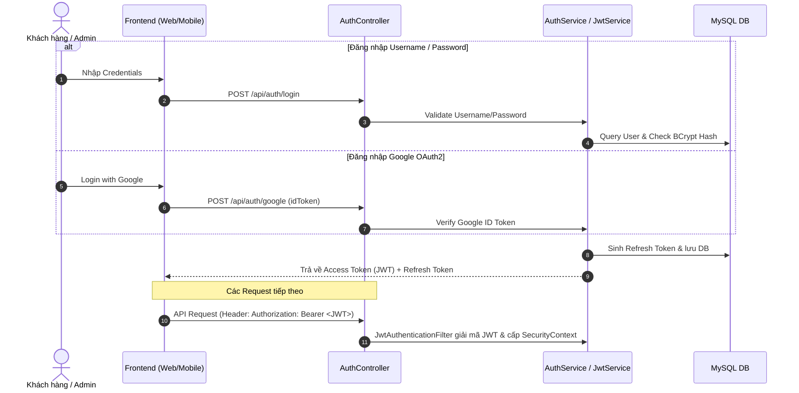
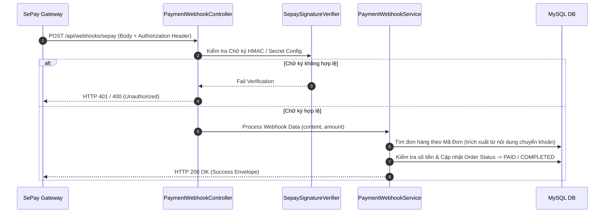
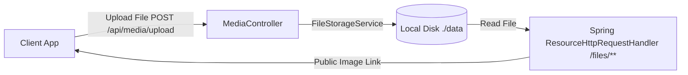
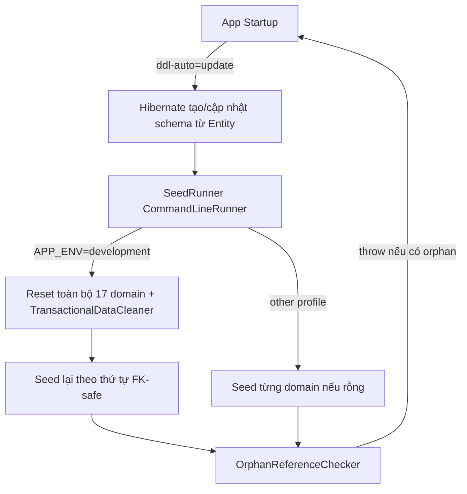
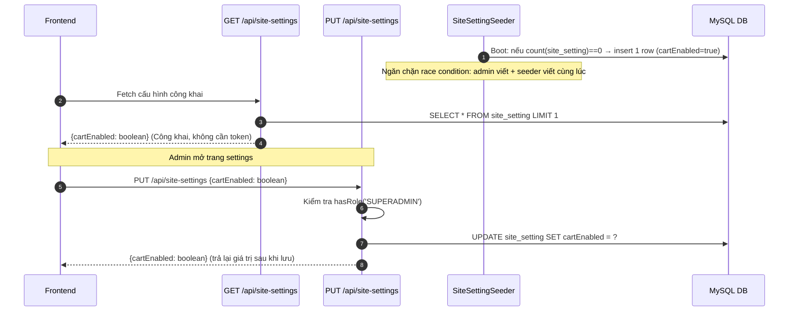
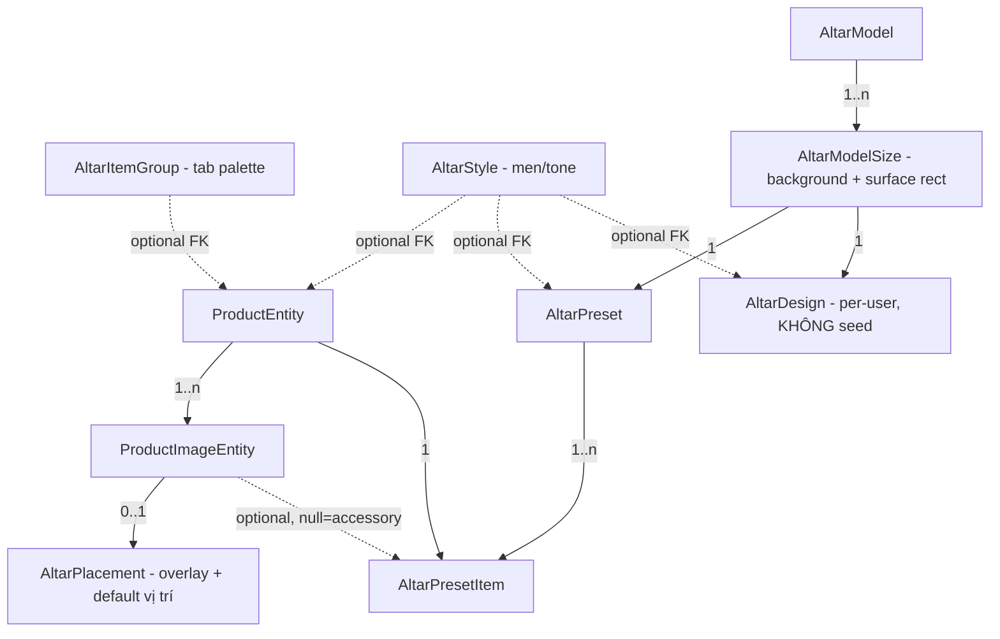

# 🏛 Gốm Sứ Vũ Gia — System Architecture & Technical Design

> **Tài liệu Kiến trúc hệ thống**: Chi tiết thiết kế luồng xử lý, luồng xác thực JWT/OAuth2, luồng đặt hàng & thanh toán, cơ chế lưu trữ đĩa local và mô hình dữ liệu.

---

## 1. Tổng quan Kiến trúc Hệ thống (System Architecture)

Hệ thống Backend Gốm Sứ Vũ Gia xây dựng trên nền **Spring Boot 3.5.10 (Java 21)** kết hợp với **MySQL 8.0**, schema quản lý code-first qua Hibernate (`ddl-auto=update`) và seed dữ liệu qua framework `DomainSeeder` (Java, xem mục 6).



---

## 2. Luồng Bảo mật & Xác thực (Authentication & Authorization Flow)

Hệ thống hỗ trợ 2 hình thức xác thực chính: Đăng nhập truyền thống (Username/Email + Password) và Đăng nhập Google (OAuth2 ID Token).



---

## 3. Luồng Xử lý Đặt hàng & Thanh toán (Order & Payment Processing)

Luồng đặt hàng được thiết kế đảm bảo **Idempotency** (chống đặt trùng đơn) và xử lý giao dịch nguyên tử (Atomic Coupon Redemption & Stock Check).

```mermaid
sequenceDiagram
    autonumber
    actor Customer as Khách hàng
    participant API as OrderController / OrderService
    participant DB as MySQL DB
    participant Event as Spring Event Publisher
    participant Mail as OrderEmailListener

    Customer->>API: POST /api/orders (Payload + Coupon Code + Idempotency Key)
    API->>DB: Check Trùng Idempotency Key
    API->>DB: Kiểm tra tồn kho & Validate Coupon nguyên tử
    API->>DB: Tạo Order, OrderItems & Cập nhật lượt dùng Coupon
    API->>DB: Xóa các sản phẩm đã đặt khỏi Cart (nếu có)
    API->>DB: Lưu giao dịch PaymentTransaction (PENDING)
    
    API->>Event: Publish OrderPlacedEvent(orderId)
    API-->>Customer: Trả về OrderResponse (Kèm thông tin QR VietQR nếu thanh toán CK)
    
    async Email Notification
        Event->>Mail: OrderEmailListener nhận sự kiện bất đồng bộ (@Async)
        Mail->>Mail: Render HTML Email với Thymeleaf Template
        Mail->>Customer: Gửi email xác nhận đặt hàng thành công
    end
```

---

## 4. Cơ chế Tiếp nhận Webhook SePay (SePay Webhook Integration)

Khi khách hàng thanh toán qua chuyển khoản ngân hàng VietQR, hệ thống nhận webhook tự động từ SePay để cập nhật đơn hàng sang trạng thái đã thanh toán.



---

## 5. Kiến trúc Lưu trữ Ảnh Local Filesystem (Local File Storage)

Tất cả tệp tin tải lên (ảnh sản phẩm, banner, tin tức) được lưu trữ trực tiếp trên đĩa cứng local tại thư mục `data/` (`APP_STORAGE_ROOT`) và phục vụ công khai qua HTTP prefix `/files/**`.



- **Entity & DTO**: Cơ sở dữ liệu chỉ lưu đường dẫn tương đối (Relative Path, ví dụ `products/ceramic-vase.jpg`).
- **Annotation `@StorageUrl`**: Tự động biến đổi Relative Path thành Absolute URL đầy đủ khi trả về JSON client (ví dụ `http://localhost:8080/files/products/ceramic-vase.jpg`).

---

## 6. Quản lý Schema Code-First & Seed Dữ liệu (`vn.springboot.seed`)

Từ 2026-07, dự án chuyển từ quản lý schema qua migration SQL sang **code-first**: JPA Entity là nguồn chân lý duy nhất của schema, không còn file migration SQL nào.



- **17 `DomainSeeder`** (interface `isEmpty()`/`reset()`/`seed()`) — 12 gốc + 5 Altar Customizer thêm ở Phase 6 (xem mục 9) — điều phối bởi `SeedRunner` theo thứ tự FK-safe cố định (không dựa vào thứ tự Spring tự inject `List<DomainSeeder>`):
  `shippingMethod → user → productCategory → altarItemGroup → altarStyle → altarModel(+sizes) → product → altarPlacement → altarPreset(+items) → newsCategory → news → banner → showroom → galleryImage → faq → page → coupon`.
- **`APP_ENV=development`**: mỗi lần khởi động xoá sạch (children-first) và seed lại toàn bộ 17 domain **và** 7 bảng giao dịch không seed (`orders`, `order_items`, `cart_items`, `payment_transactions`, `refresh_tokens`, `contact_requests`, `altar_designs`) qua `TransactionalDataCleaner` — DB coi là hoàn toàn disposable.
- **Profile khác**: mỗi domain chỉ seed nếu đang rỗng (idempotent), không bao giờ đụng vào dữ liệu đã có; 7 bảng giao dịch không bị `TransactionalDataCleaner` chạm tới.
- **`OrphanReferenceChecker`**: chạy sau mỗi lần seed, ở mọi profile — `V1` (cũ) không khai báo `FOREIGN KEY` thật nào ở tầng CSDL, nên một lỗi thứ tự seed sẽ tạo ra tham chiếu treo (dangling reference) âm thầm thay vì lỗi loud; checker kiểm tra 12 tham chiếu chéo thực tế (3 gốc: `product_images.product_id`, `products.product_category_id`, `news.news_category_id`; + 9 altar thêm ở Phase 6, xem mục 9) và `throw` nếu phát hiện orphan.

### Đánh đổi đã chấp nhận (Accepted Tradeoffs)

1. **`ddl-auto=update` áp dụng ở mọi môi trường, kể cả production** (không có override theo profile). Đây là một anti-pattern được biết đến của Hibernate: `update` không bao giờ tự xoá cột/bảng mồ côi khi một field bị xoá khỏi entity, và không còn file migration nào để review diff schema qua code review (công cụ migration trước đây có tính năng này). Chấp nhận có chủ đích vì dự án chưa có dữ liệu production thật ở thời điểm chuyển đổi (2026-07-27); không có kế hoạch bổ sung tooling diff schema ở quy mô hiện tại.
2. **`/actuator/health` có thể báo `UP` trước khi `SeedRunner` seed xong.** `SeedRunner` là một `CommandLineRunner`, chạy sau khi Tomcat đã khởi động xong — nghĩa là có một khoảng hở ngắn mà health check có thể trả về "khỏe mạnh" trong khi catalog vẫn đang rỗng (đặc biệt rõ ở lần boot đầu tiên trên DB trống). Chấp nhận không thêm `HealthIndicator` tùy chỉnh để đóng khoảng hở này; ghi nhận như một giới hạn đã biết.

---

## 7. Site Settings Singleton Config (Feature Flag: Cart-Mode Toggle)

Quản lý cấu hình toàn site (chẳng hạn như bật/tắt chế độ giỏ hàng) thông qua một entity singleton.



**Lưu ý về thực thi (Enforcement Boundary):** `cartEnabled=false` là một **UI-only gate** trên client (header, giỏ hàng, checkout bị ẩn; Product pages/Customizer mở contact form modal). Backend **không** kiểm tra flag này trên các endpoint cart/coupon — `/api/cart`, `/api/coupons/validate`, `POST /api/orders` đều vẫn chấp nhận request. Điều này là đã chấp nhận: frontend hoàn toàn kiểm soát UX hiển thị, backend tin tưởng vào quyết định frontend.

---

## 8. Contact Request Notification Email Flow

Mỗi khi khách hàng gửi form liên hệ (thông qua `/lien-he` page hoặc modal từ product page), hệ thống gửi email thông báo tới admin.

```mermaid
sequenceDiagram
    autonumber
    participant Client as Frontend
    participant POST as POST /api/contact-requests
    participant EventBus as Spring Event Publisher
    participant Listener as ContactRequestEmailListener
    participant Mail as SMTP Email Server
    participant Admin as Admin (CONTACT_NOTIFY_EMAIL)

    Client->>POST: Gửi {name, email, phone, content}
    POST->>POST: Validate + Save ContactRequestEntity
    POST->>EventBus: Publish ContactRequestSubmittedEvent(contactRequestId)
    POST-->>Client: HTTP 200 OK (đơn xin được lưu, UX phản hồi thành công ngay)
    
    async Email (Background)
        EventBus->>Listener: @Async @TransactionalEventListener(AFTER_COMMIT)
        Listener->>Listener: Render HTML via Thymeleaf (contact-notification.html)
        Listener->>Mail: Gửi email tới CONTACT_NOTIFY_EMAIL
        Mail->>Admin: Nhận email thông báo (nếu CONTACT_NOTIFY_EMAIL != empty)
    end
    
    Note over POST, Admin: Nếu CONTACT_NOTIFY_EMAIL trống → không gửi email (no-op, không lỗi)
```

**Cấu hình:**
- **`app.mail.contact-notify-to`** / **`CONTACT_NOTIFY_EMAIL`**: Địa chỉ email nhận thông báo liên hệ. Mặc định trống (rỗng string, không phải null) → email không gửi.
- **`contact-notification.html`**: Thymeleaf template hiển thị thông tin contact (name, email, phone, content) với `th:text` (không `th:utext`) để tránh HTML injection từ trường `content` của khách.
- **Async & No-Block:** Email được gửi bất đồng bộ trong background (`@Async`), không chặn response HTTP. Nếu gửi email thất bại, request vẫn trả về 200 OK (failure-safe).

---

## 9. Altar Customizer — Domain Model & Seed Data (Phase 1-6)

Tính năng "Tuỳ chỉnh bàn thờ" (storefront canvas cho khách kéo-thả sản phẩm lên ảnh bàn thờ, admin CRUD taxonomy/placement/preset) được xây qua 6 phase; Phase 6 là phase cuối, seed dữ liệu thật và verification.



**7 bảng catalog (seeded) + 1 bảng transactional (không seed):**

| Entity | Vai trò | FK | Seed (Phase 6) |
|---|---|---|---|
| `AltarItemGroupEntity` | Tab palette storefront (vd "Bát hương & phụ kiện"). `renderOnAltar=false` = nhóm chỉ hiện danh sách/tổng số lượng, không đặt lên canvas. | — | 6 dòng (5 `renderOnAltar=true` + 1 `false`) |
| `AltarStyleEntity` | Men/tone gốm (Men lam, Men rạn...). | — | 5 dòng |
| `AltarModelEntity` | Loại bàn thờ (vd "Bàn thờ gia tiên"). | — | 1 dòng |
| `AltarModelSizeEntity` | Kích thước cụ thể: ảnh nền + surface rect (`surfaceLeft/Top/Right/Bottom`, tỉ lệ [0,1] trên ảnh nền) + `surfaceWidthCm` để scale item theo kích thước thật. | `altar_model_id` | 3 dòng (127/153/175cm, cùng 1 ảnh nền — chỉ có 1 ảnh nền thật trong repo) |
| `AltarPlacementEntity` | Vị trí mặc định + overlay PNG trong suốt cho **1 product image cụ thể** (`0..1`, unique trên `product_image_id`). `zIndexOverride=null` = auto-z từ `defaultY`. | `product_image_id` (1:1) | 3 dòng — chỉ 3 ảnh `bat-huong-1/2/3.png`, quyết định D1: không tạo overlay giả cho sản phẩm không có ảnh trong suốt thật |
| `AltarPresetEntity` | Bộ gợi ý dựng sẵn (admin author), gắn với đúng 1 `AltarModelSize`, style optional. | `altar_model_size_id`, `altar_style_id?` | 1 dòng ("Bộ tiêu chuẩn") |
| `AltarPresetItemEntity` | 1 item trong preset — 2 dạng phân biệt bằng nullability: canvas item (`productImage`+`x`+`y` đều set) hoặc accessory (`productImage`/`x`/`y` đều null, chỉ `quantity`). | `preset_id`, `product_id`, `product_image_id?` | 4 dòng (1 canvas + 3 accessory) |
| `AltarDesignEntity` | Thiết kế đã lưu của khách hàng ("Lưu vào thư viện"), ownership-check tại service layer (404 nếu không phải chủ sở hữu, không 403). | `user_id`, `altar_model_size_id`, `altar_style_id?` | **KHÔNG seed** — transactional, giới hạn 20/tài khoản, dọn ở `TransactionalDataCleaner` |

`ProductEntity` có thêm 2 FK optional `altarItemGroup`/`altarStyle` (chỉ gán cho 9 sản phẩm `BO_DO_THO` thuộc bộ altar-customizer seed ở `ProductSeeder`; mọi sản phẩm/category khác giữ `null`).

**Bộ dữ liệu seed (quyết định D1/D6 trong plan Phase 6):** chỉ dùng 8 ảnh thật có sẵn ở `vu-gia-client/public/assets/images/altar-customizer/` (`altar-preview.png`, `bat-huong-1/2/3.png`, `accessories-sprite.png`, `similar-product-1/2/3.jpg`), lưu dạng bare relative path (`assets/images/altar-customizer/...`, cùng convention với `ProductCategorySeeder`) — không tạo ảnh placeholder giả. Hệ quả chấp nhận: chỉ nhóm "Bát hương & phụ kiện" có thể kéo-thả lên canvas thật (3 placement); 5 nhóm còn lại hiện trong palette với sản phẩm/ảnh thật nhưng chưa kéo-thả được — đây là scope reduction có chủ đích, không phải lỗi.

**`ProductSeeder`'s `buildProducts()` — rủi ro thứ tự vị trí (positional index risk).** Combo #12 (index 11) resolve 3 sub-product bằng `saved.get(8/9/10)` theo **vị trí trong list**, không phải id. 9 sản phẩm altar-set mới được **append sau index 11** (không chèn giữa danh sách gốc), giữ nguyên 100% logic/index đã test của combo — lựa chọn rủi ro thấp hơn so với refactor toàn bộ sang tra cứu theo slug (phương án còn lại plan có đề xuất). FK altar item group/style dùng map tra theo `slug` (code mới, không có hành vi cũ cần bảo toàn).
