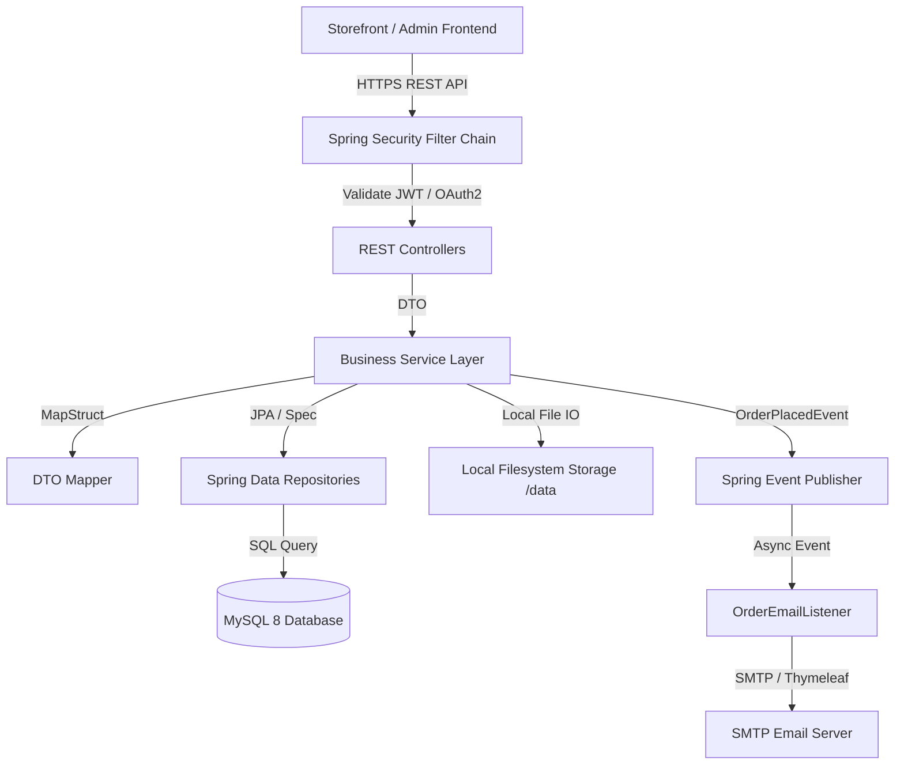
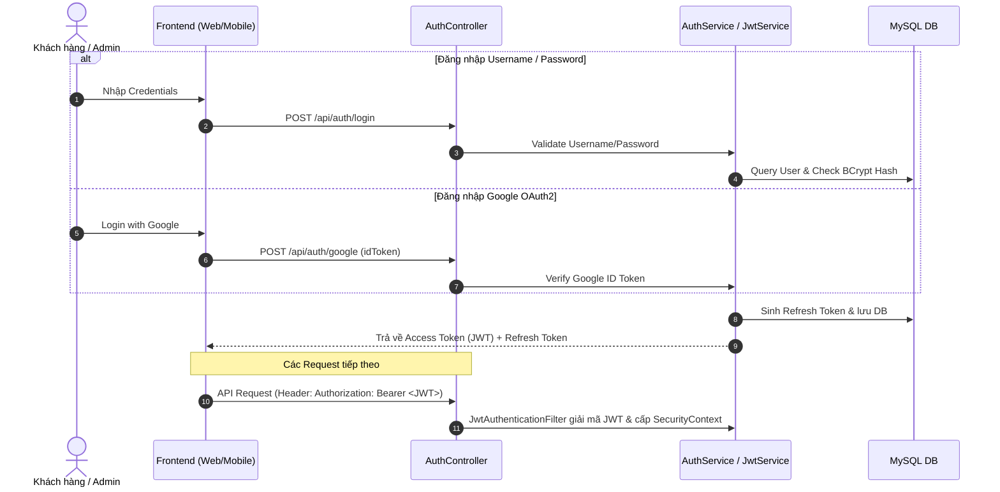
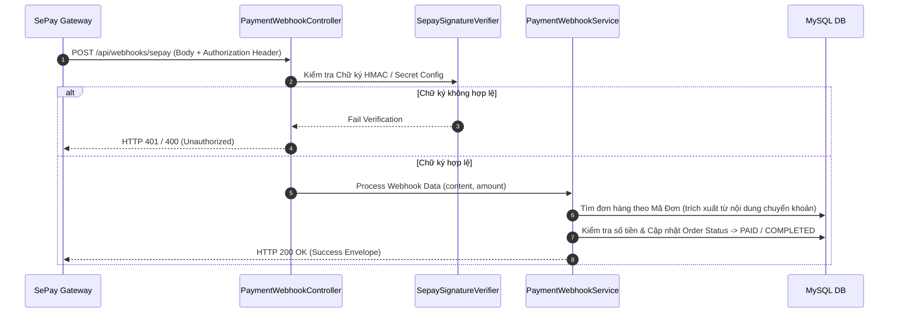
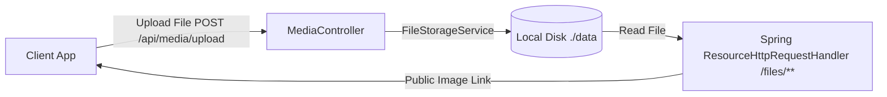

# 🏛 Gốm Sứ Vũ Gia — System Architecture & Technical Design

> **Tài liệu Kiến trúc hệ thống**: Chi tiết thiết kế luồng xử lý, luồng xác thực JWT/OAuth2, luồng đặt hàng & thanh toán, cơ chế lưu trữ đĩa local và mô hình dữ liệu.

---

## 1. Tổng quan Kiến trúc Hệ thống (System Architecture)

Hệ thống Backend Gốm Sứ Vũ Gia xây dựng trên nền **Spring Boot 3.5.10 (Java 21)** kết hợp với **MySQL 8.0** và **Flyway Database Migration**.



---

## 2. Luồng Bảo mật & Xác thực (Authentication & Authorization Flow)

Hệ thống hỗ trợ 2 hình thức xác thực chính: Đăng nhập truyền thống (Username/Email + Password) và Đăng nhập Google (OAuth2 ID Token).



---

## 3. Luồng Xử lý Đặt hàng & Thanh toán (Order & Payment Processing)

Luồng đặt hàng được thiết kế đảm bảo **Idempotency** (chống đặt trùng đơn) và xử lý giao dịch nguyên tử (Atomic Coupon Redemption & Stock Check).

```mermaid
sequenceDiagram
    autonumber
    actor Customer as Khách hàng
    participant API as OrderController / OrderService
    participant DB as MySQL DB
    participant Event as Spring Event Publisher
    participant Mail as OrderEmailListener

    Customer->>API: POST /api/orders (Payload + Coupon Code + Idempotency Key)
    API->>DB: Check Trùng Idempotency Key
    API->>DB: Kiểm tra tồn kho & Validate Coupon nguyên tử
    API->>DB: Tạo Order, OrderItems & Cập nhật lượt dùng Coupon
    API->>DB: Xóa các sản phẩm đã đặt khỏi Cart (nếu có)
    API->>DB: Lưu giao dịch PaymentTransaction (PENDING)
    
    API->>Event: Publish OrderPlacedEvent(orderId)
    API-->>Customer: Trả về OrderResponse (Kèm thông tin QR VietQR nếu thanh toán CK)
    
    async Email Notification
        Event->>Mail: OrderEmailListener nhận sự kiện bất đồng bộ (@Async)
        Mail->>Mail: Render HTML Email với Thymeleaf Template
        Mail->>Customer: Gửi email xác nhận đặt hàng thành công
    end
```

---

## 4. Cơ chế Tiếp nhận Webhook SePay (SePay Webhook Integration)

Khi khách hàng thanh toán qua chuyển khoản ngân hàng VietQR, hệ thống nhận webhook tự động từ SePay để cập nhật đơn hàng sang trạng thái đã thanh toán.



---

## 5. Kiến trúc Lưu trữ Ảnh Local Filesystem (Local File Storage)

Tất cả tệp tin tải lên (ảnh sản phẩm, banner, tin tức) được lưu trữ trực tiếp trên đĩa cứng local tại thư mục `data/` (`APP_STORAGE_ROOT`) và phục vụ công khai qua HTTP prefix `/files/**`.



- **Entity & DTO**: Cơ sở dữ liệu chỉ lưu đường dẫn tương đối (Relative Path, ví dụ `products/ceramic-vase.jpg`).
- **Annotation `@StorageUrl`**: Tự động biến đổi Relative Path thành Absolute URL đầy đủ khi trả về JSON client (ví dụ `http://localhost:8080/files/products/ceramic-vase.jpg`).
